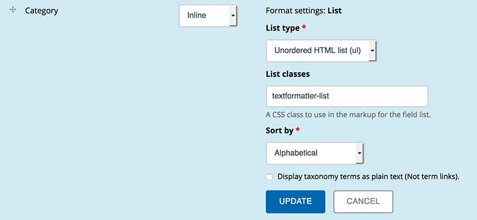

#Text Formatter

This module provides an additional formatter to render values in all
core fields as HTML or comma-separated lists.

For multi-value fields, each field value becomes a list item. For long text
fields, each line becomes a list item.

Text Formatter also provides hooks (see textformatter.api.php) so that other
modules can register and implement listings for their field data. The
textformatter_contrib module provides some implementations. This is bundled
with this module. Currently entityreference, node reference, and link fields
are supported.

##Installation

- Install this module using the official Backdrop CMS instructions at
  https://backdropcms.org/guide/modules

##Configuration

There is no special configuration for this module.  You may configure it just as
you would any other field formatter on the "Manage display" tab.

##Issues

Bugs and Feature requests should be reported in the Issue Queue:
https://github.com/backdrop-contrib/textformatter/issues

##Current Maintainers

- Laryn Kragt Bakker - CEDC.org (https://github.com/laryn/)

##Credits

- Ported to Backdrop CMS by Laryn Kragt Bakker - CEDC.org 
  (https://github.com/laryn/).
- Initiated and maintained for Drupal 7 by Damian Lee 
  (https://github.com/damiankloip).
- Originally developed for Drupal 6 by Larry Garfield & Emily Brand 
  (Palantir.net).

##License

This project is GPL v2 software. See the [LICENSE.txt](LICENSE.txt) file in 
this directory for complete text.
